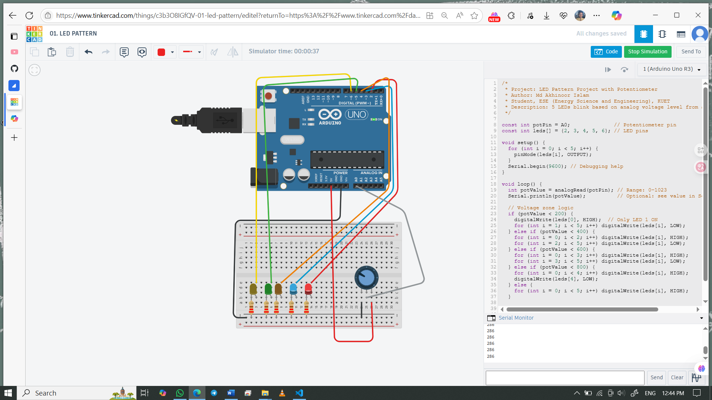

# LED Pattern Project with Potentiometer Control

This project uses a potentiometer to control the blinking pattern of 5 LEDs based on analog voltage levels.

## 👨‍🎓 Project by:
Md Akhinoor Islam  
ESE (Energy Science and Engineering), KUET

## 🔧 Components Used
- Arduino UNO
- Breadboard
- 5 x LED
- 5 x 220Ω resistor
- 1 x Potentiometer
- Jumper wires

## 🔌 Circuit Overview
- Potentiometer output connected to A0 (Analog Input)
- LEDs connected to digital pins D2–D6 via 220Ω resistors
- Blinking logic controlled by analog voltage level from potentiometer

🖼️ **Circuit Diagram:**  

## 🔗 Simulation
[🔗 https://www.tinkercad.com/things/c3b3O8IGfQV-01-led-pattern] 

## 📂 Folder Contents

- `README.md` → This file  
- `circuit.png` → Your Tinkercad screenshot  
- `code/led-sequential.ino` → Arduino source code
- `Code & Circuit Explanation(for beginner).md` → Circuit explanation & code breakdown  
---

## 💡 Learning Highlights
- Analog to digital conversion (ADC) with A0
- Using potentiometer as analog input
- Conditional control of multiple outputs based on voltage thresholds
