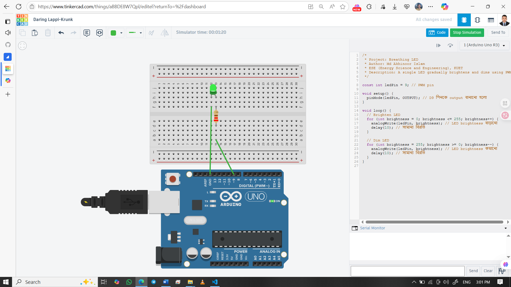

# 🌬️ Breathing LED Effect

This Arduino project simulates a **breathing effect** by smoothly fading an LED in and out using PWM (Pulse Width Modulation).

## 👨‍🎓 Developed By
Md Akhinoor Islam  
ESE (Energy Science and Engineering), KUET

---

## 🔧 Components Used

| Component       | Quantity |
|----------------|----------|
| Arduino UNO     | 1        |
| LED             | 1        |
| 220Ω Resistor   | 1        |
| Breadboard      | 1        |
| Jumper Wires    | as needed |

---

## 🔌 Circuit Overview

- LED Anode (+) → 220Ω resistor → **D9**
- LED Cathode (–) → **GND**
- Breadboard used for easy prototyping

🖼️ **Circuit Diagram**  

🔗 **Live Simulation:**  
[🔗 Tinkercad Project](https://www.tinkercad.com/things/aBBDE8W7Qpl-03-breathing-led)

---

## 💡 Learning Highlights

- 🎚️ PWM (Pulse Width Modulation) concept using `analogWrite()`
- 🔁 `for loop` usage for smooth transitions
- 🧠 Understanding brightness levels (0–255)
- 🕓 Using `delay()` for timing control
- 📟 Using PWM-enabled pins like D9 on Arduino UNO

---

## 🧠 Code Summary

LED brightness increases from 0 to 255 and then decreases back to 0, creating a smooth breathing pattern. This is done using a `for` loop and `analogWrite()`.

---

## 📂 Folder Contents

- `README.md` → this file  
- `code/breathing-led.ino` → Arduino source code  
- `circuit.png` → screenshot of your Tinkercad simulation  
- `Code & Circuit Explanation(for beginner).md` → Circuit explanation & code breakdown  
---

## ✅ Project Status

💡 **Completed**  
🔁 Repeats smoothly  
📌 Uploaded to GitHub as part of Akhinoor’s 40-project Arduino journey!
