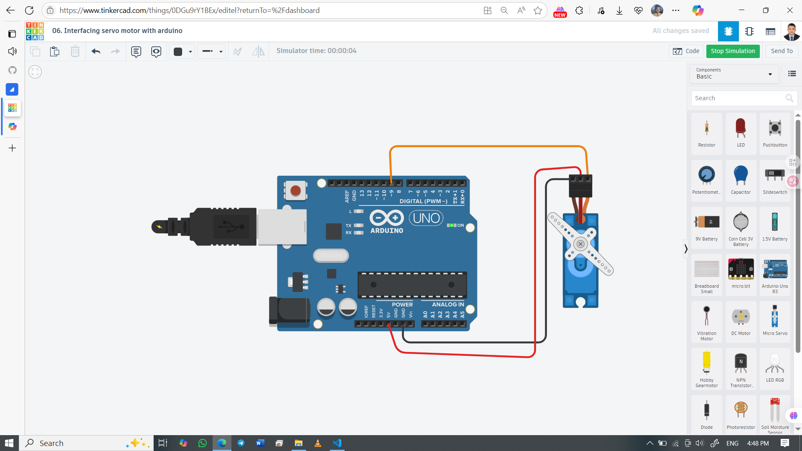

# 🤖 Servo Motor Interfacing with Arduino

Control a servo motor's angular movement from 0° to 180° and back using Arduino UNO. This project teaches smooth motion using `Servo.h` library.

## 👨‍🎓 Developed By
Md Akhinoor Islam  
ESE (Energy Science and Engineering), KUET

---

## 🔧 Components Used

| Component       | Quantity |
|----------------|----------|
| Arduino UNO     | 1        |
| Servo Motor (SG90) | 1     |
| Breadboard      | 1        |
| Jumper Wires    | as needed |

---

## 🔌 Circuit Overview

| Servo Wire | Arduino Pin | Purpose          |
|------------|-------------|------------------|
| Red        | 5V          | Power             |
| Brown/Black| GND         | Ground            |
| Orange/Yellow | D9      | Signal (PWM Input) |

🖼️ **Circuit Diagram**  

🔗 **Tinkercad Simulation**  
[🔗 Click to View](https://www.tinkercad.com/things/0DGu9rY1BEx-06-interfacing-servo-motor-with-arduino)

---

## 💡 Learning Highlights

- ⚙️ Using `Servo.h` library to control servo motors
- 🔁 Creating smooth motion using `for` loops
- 🎛️ Understanding servo signal pins and angle control
- 🧠 Basics of PWM in mechanical control systems
- 🤖 Foundation for robotics and embedded motion control

---

## 🧠 Code Summary

The servo rotates from 0° to 180° and then back to 0°, smoothly and continuously in a loop.

---

## 📂 Folder Contents

- `README.md` → Project documentation  
- `code/servo-control.ino` → Arduino source code  
- `circuit.png` → Tinkercad circuit snapshot  
- `Code & Circuit Explanation(for beginner).md` → Circuit explanation & code breakdown  
---

## ✅ Project Status

✔️ **Working Simulation on Tinkercad**  
🌀 Smooth servo sweep  
📦 Part of Akhinoor’s Arduino 40-project learning journey  
