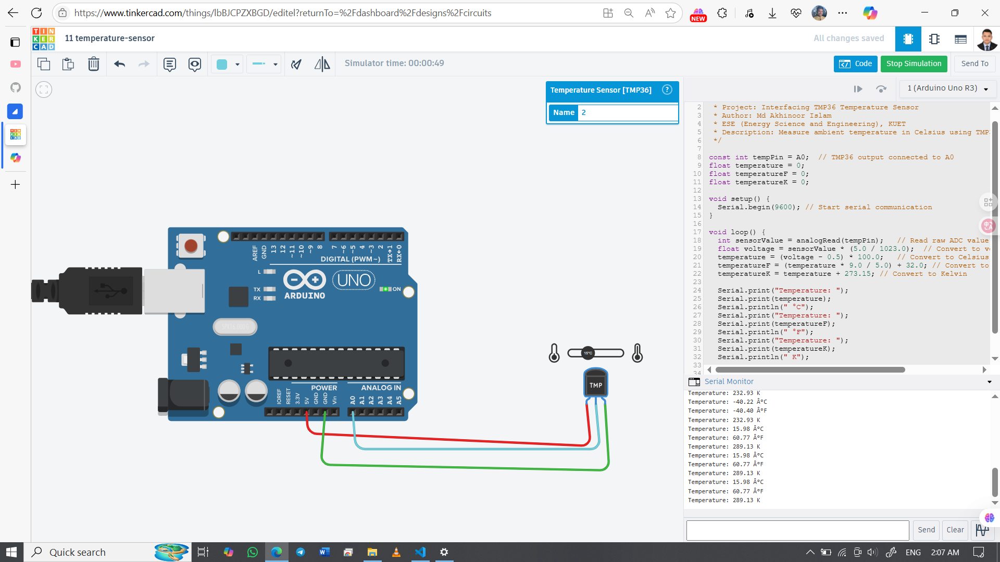

# 🌡️ TMP36 Temperature Sensor with Arduino UNO

Measure ambient temperature using the **TMP36 analog temperature sensor** and display the result in Celsius via Serial Monitor.

## 👨‍🎓 Developed By
Md Akhinoor Islam  
ESE (Energy Science and Engineering), KUET

---

## 🔧 Components Used

| Component        | Quantity |
|------------------|----------|
| Arduino UNO       | 1        |
| TMP36 Sensor       | 1        |
| Breadboard         | 1        |
| Jumper Wires       | as needed |

---

## 🔌 Circuit Overview

| TMP36 Pin | Arduino Pin | Description             |
|-----------|--------------|-------------------------|
| VCC       | 5V           | Power input             |
| GND       | GND          | Ground                  |
| Vout      | A0           | Analog output to Arduino|

🖼️ **Circuit Diagram**  

🔗 **Tinkercad Simulation**  
[🔗 Click to View](https://www.tinkercad.com/things/lbBJCPZXBGD-11-temperature-sensor)

---

## 💡 Learning Highlights

- 🌡️ Analog temperature sensing with TMP36  
- 📏 Voltage-to-temperature conversion  
- 🧠 Understanding ADC (Analog to Digital Conversion)  
- 💬 Serial Monitor output for real-time feedback

---

## 📂 Folder Contents

- `README.md` → Project overview  
- `Code & Circuit Explanation(for beginner).md` → Circuit + code explanation  
- `code/temperature-tmp36.ino` → Arduino sketch  
- `circuit.png` → Tinkercad screenshot  

---

## ✅ Project Status

✔️ Simulated successfully on Tinkercad  
🌡️ Accurate temperature readings  
📦 Part of Akhinoor’s 40 Arduino Project Series
