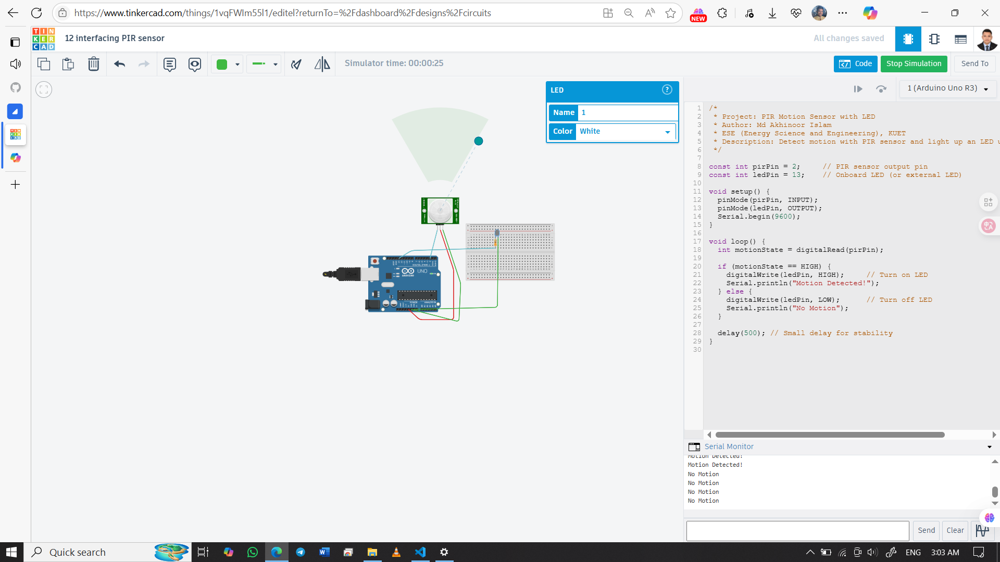

# 🕵️ PIR Motion Sensor with LED (Arduino UNO)

Detect motion using a PIR sensor and trigger an LED as an alert. This project introduces the basics of motion-sensing and digital I/O interaction in Arduino.

## 👨‍🎓 Developed By  
Md Akhinoor Islam  
ESE (Energy Science and Engineering), KUET

---

## 🔧 Components Used

| Component       | Quantity |
|------------------|----------|
| Arduino UNO       | 1        |
| PIR Motion Sensor | 1        |
| LED               | 1        |
| 220Ω Resistor     | 1        |
| Breadboard        | 1        |
| Jumper Wires      | as needed |

---

## 🔌 Circuit Overview

| Component    | Arduino Pin | Function                        |
|--------------|--------------|---------------------------------|
| PIR OUT      | D2           | Motion signal input to Arduino |
| LED (+)      | D13          | Turns ON when motion detected  |
| LED (–)      | GND via 220Ω | With current-limiting resistor |
| PIR VCC      | 5V           | Power to PIR sensor            |
| PIR GND      | GND          | Common ground                  |

🖼️ **Circuit Diagram**  

🔗 **Tinkercad Simulation**  
[🔗 Click to View](https://www.tinkercad.com/things/1vqFWIm55l1-12-interfacing-pir-sensor)

---

## 💡 Learning Highlights

- 📡 Working of PIR (Passive Infrared) sensor  
- 💡 Triggering LEDs via digital signals  
- 🧠 Understanding `digitalRead()` and `digitalWrite()`  
- 🕹️ Real-time feedback via Serial Monitor  
- 🔁 Basic condition checking using `if-else` structure

---

## 📂 Folder Contents

- `README.md` → Project overview  
- `Code & Circuit Explanation (for beginner).md` → Beginner-friendly learning guide  
- `code/pir-motion-led.ino` → Arduino sketch  
- `circuit.png` → Simulation image

---

## ✅ Project Status

✔️ Tested and verified on Tinkercad  
💡 LED responds to motion  
📦 Part of Akhinoor’s 40 Arduino Project Series
