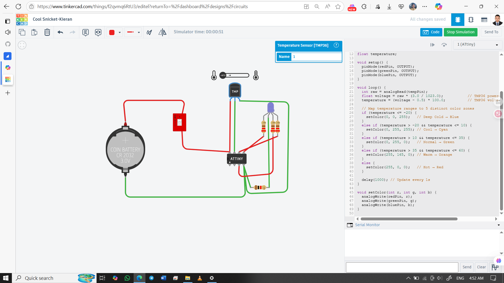

# 🌡️ TMP36 + ATtiny85 + RGB LED (5-Color Temperature Indicator)

This project uses a TMP36 analog temperature sensor with an ATtiny85 microcontroller to display temperature zones using an RGB LED. The system is powered by a 3V coin cell and controlled via a DIP switch.

## 👨‍🎓 Developed By  
Md Akhinoor Islam  
ESE (Energy Science and Engineering), KUET

---

## 🔧 Components Used

| Component         | Quantity |
|-------------------|----------|
| ATtiny85           | 1        |
| TMP36 Temperature Sensor | 1  |
| RGB LED (Common Cathode) | 1 |
| 220Ω Resistors     | 3        |
| DIP Switch         | 1        |
| 3V Coin Cell       | 1        |
| Breadboard         | 1        |
| Jumper Wires       | as needed |

---

## 🔌 Circuit Overview

| Component     | ATtiny85 Pin | Description                        |
|---------------|--------------|------------------------------------|
| TMP36 Vout    | A1 (PB2)     | Analog input (Pin 7)               |
| RGB RED       | PB0          | PWM output (Pin 5)                 |
| RGB GREEN     | PB1          | PWM output (Pin 6)                 |
| RGB BLUE      | PB4          | PWM output (Pin 3)                 |
| DIP Switch    | Between Battery + and VCC | Controls power to ATtiny |
| Battery –     | GND (Pin 4)  | Common ground                      |

🖼️ **Circuit Diagram**  

🔗 **Tinkercad Simulation**  
[🔗 Click to View](https://www.tinkercad.com/things/f2qvmq6RtU3-14-attiny-tmp36-rgb)

---

## 💡 Learning Highlights

- 🌡️ TMP36 analog temperature sensing  
- 🔋 Low-power ATtiny85 operation with DIP switch  
- 🌈 RGB LED color mapping based on temperature  
- 🧠 PWM control and analog voltage conversion  
- 🛠️ Embedded system design with minimal components

---

## 📂 Folder Contents

- `README.md` → Project overview  
- `Code & Circuit Explanation (for beginner).md` → Circuit + code explanation  
- `code/attiny85-tmp36-5color.ino` → Arduino sketch  
- `circuit.png` → Tinkercad screenshot

---

## ✅ Project Status

✔️ Simulated successfully on Tinkercad  
🌈 RGB LED responds to temperature zones  
📦 Part of Akhinoor’s 40 Arduino Project Series
