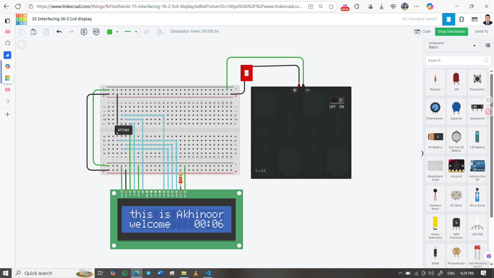

# 📺 16×2 LCD Display with ATtiny85 (Real-Time Clock)

This project uses an ATtiny85 microcontroller to drive a 16×2 LCD display in 4-bit mode. It shows a static message on the first line and a real-time minute:second counter on the second line. The system is powered by a 1.5V battery with a step-up converter and controlled via a DIP switch.

## 👨‍🎓 Developed By  
Md Akhinoor Islam  
ESE (Energy Science and Engineering), KUET

---

## 🔧 Components Used

| Component         | Quantity |
|-------------------|----------|
| ATtiny85           | 1        |
| 16×2 LCD Display    | 1        |
| Step-Up Converter (1.5V → 5V) | 1 |
| 1.5V Battery        | 1        |
| DIP Switch          | 1        |
| Jumper Wires        | as needed |
| Breadboard          | 1        |

---

## 🔌 Circuit Overview

| LCD Pin | Function      | ATtiny85 Pin         | Battery/Power Connection         |
|---------|---------------|----------------------|----------------------------------|
| 1       | GND           | GND                  | Battery (–), Step-Up GND         |
| 2       | VCC           | VCC                  | Step-Up Converter Output (5V) (+)|
| 3       | V0            | GND                  | Battery (–), Step-Up GND         |
| 4       | RS            | PB0                  | —                                |
| 5       | RW            | GND                  | Battery (–), Step-Up GND         |
| 6       | E             | PB1                  | —                                |
| 11      | D4            | PB2                  | —                                |
| 12      | D5            | PB3                  | —                                |
| 13      | D6            | PB4                  | —                                |
| 14      | D7            | PB5                  | —                                |
| 15      | LED Anode     | —                    | Step-Up Converter Output (5V) (+) via 220Ω resistor |
| 16      | LED Cathode   | —                    | Battery (–), Step-Up GND         |

📌 **Note:**  
- DIP switch is placed between battery (+) and step-up input for power control.  
- Use a **step-up converter (MT3608)** to boost 1.5V from the battery to 5V for the ATtiny85 and LCD.  
- You can use an **LCD I2C backpack** to save pins (uses only two pins, e.g. A4/A5, if using software I2C).

---

## 💡 Display Output

The last 4 characters update every second using `millis()`.

---

## 🧠 Learning Highlights

- 🧾 LCD interfacing in 4-bit mode with minimal pins  
- 🔋 Low-voltage power design using 1.5V battery + boost  
- ⏱️ Real-time clock using `millis()` without RTC  
- 🧠 Cursor control and formatted display  
- 🧰 Embedded system design with DIP switch power gating

---

## 🖼️ Circuit Diagram  

---

## 🔗 Tinkercad Simulation  
[🔗 Click to View](https://www.tinkercad.com/things/9rFJex9xeob-15-interfacing-16-2-lcd-display)

---

## 📂 Folder Contents

- `README.md` → Project overview  
- `Code & Circuit Explanation (for beginner).md` → Circuit + code explanation  
- `code/attiny85-lcd-clock.ino` → Arduino sketch  
- `circuit.png` → Tinkercad screenshot

---

## ✅ Project Status

✔️ Simulated successfully on Tinkercad  
📺 LCD displays message and real-time clock  
📦 Part of Akhinoor’s 40 Arduino Project Series
## ✅ Project Status

✔️ Simulated successfully on Tinkercad  
📺 LCD displays message and real-time clock  
📦 Part of Akhinoor’s 40 Arduino Project Series
