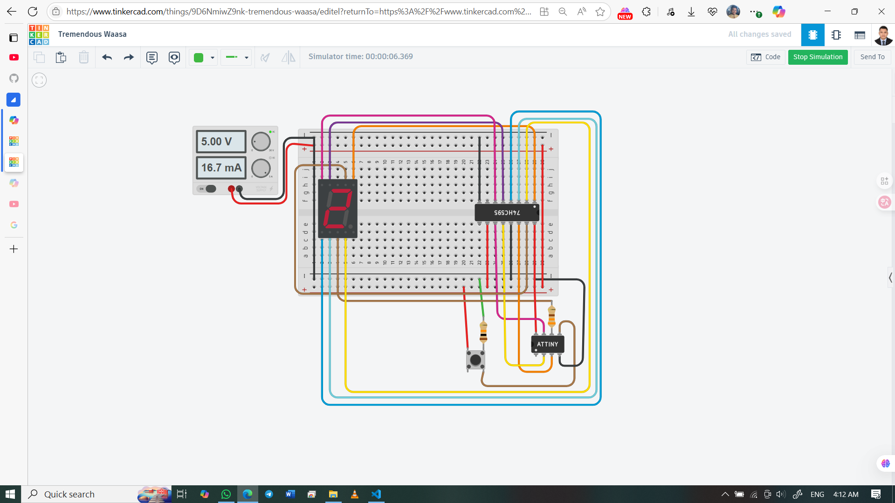

# 🎲 Dice with 7-Segment Display using ATtiny85 + 74HC595

This project simulates a dice roll (1–6) using a 7-segment display, ATtiny85 microcontroller, and 74HC595 shift register. A push button triggers the roll, and the result is shown with a smooth animation. The system is compact, efficient, and ideal for learning embedded control with limited I/O.

## 👨‍🎓 Developed By  
Md Akhinoor Islam  
ESE (Energy Science and Engineering), KUET

---

## 🔧 Components Used

| Component               | Quantity |
|--------------------------|----------|
| ATtiny85 Microcontroller | 1        |
| 74HC595 Shift Register   | 1        |
| 7-Segment Display (CC)   | 1        |
| Push Button              | 1        |
| LED (Optional)           | 1        |
| 330Ω Resistors           | 7        |
| 10kΩ Resistor (Optional) | 1        |
| Breadboard + Jumper Wires| as needed |
| Power Supply (3–5V)      | 1        |

---

## 🔌 Circuit Overview

| Source Device | Pin Description         | Pin No. | Connects To                  | Function / Notes                               |
|---------------|--------------------------|---------|-------------------------------|------------------------------------------------|
| ATtiny85      | PB0                      | Pin 5   | Push Button (2a)             | Button input (trigger on HIGH)                |
| ATtiny85      | PB2                      | Pin 7   | 74HC595 Pin 11 (SH_CP)       | Shift Clock                                    |
| ATtiny85      | PB3                      | Pin 2   | 74HC595 Pin 12 (ST_CP)       | Latch Clock                                    |
| ATtiny85      | PB4                      | Pin 3   | 74HC595 Pin 14 (DS)          | Serial Data Input                              |
| ATtiny85      | VCC                      | Pin 8   | 5V Supply                     | Power                                           |
| ATtiny85      | GND                      | Pin 4   | GND                           | Ground                                          |
| ATtiny85      | PB1                      | Pin 6   | 330Ω → 7-Segment Common GND  | Drives display cathode (CC type)              |
| 74HC595       | Q0–Q6                    | Pins 15,1–6 | Segment a–g (via 330Ω)  | Segment outputs                                |
| 74HC595       | Q7'                      | Pin 9   | (Optional cascade)           | Not used                                       |
| 74HC595       | OE (Output Enable)       | Pin 13  | GND                           | Always enabled (Active LOW)                   |
| 74HC595       | MR (Master Reset)        | Pin 10  | VCC                           | Tied HIGH (disable reset)                     |
| 74HC595       | VCC                      | Pin 16  | 5V Supply                     | Power                                           |
| 74HC595       | GND                      | Pin 8   | GND                           | Ground                                          |
| Push Button   | Terminal 2a              |         | PB0 (ATtiny85 Pin 5)         | Input signal                                    |
| Push Button   | Terminal 1b              |         | VCC                           | Button sends HIGH when pressed                 |
| Push Button   | Terminal 2b              |         | 10kΩ → GND                    | Pull-down resistor                             |
| 7-Segment     | Segment a–g              |         | Q0–Q6 of 74HC595 (via 330Ω)  | Segment control lines                          |
| 7-Segment     | Common Cathode           |         | PB1 via 330Ω                 | Shared cathode to GND                          |

---

## 💡 Learning Highlights

- 🧠 Shift register interfacing with ATtiny85  
- 🔢 Binary pattern control of 7-segment display  
- 🎲 Random number generation using analog noise  
- 🌀 Animation logic using loops and delays  
- 🧰 Macro usage for display type flexibility (CC/CA)

---

## 🖼️ Circuit Diagram  

---

## 🔗 Tinkercad Simulation  
[🔗 View Simulation on Tinkercad](https://www.tinkercad.com/things/9D6NmiwZ9nk-16-dice-with-7-segment-display)

---

## 📂 Folder Contents

- `README.md` → Project overview  
- `Code & Circuit Explanation (for beginner).md` → Circuit + code explanation  
- `code/dice-7segment-shift-v1.ino` → Version 1 Arduino sketch  
- `code/dice-7segment-shift-v2.ino` → Version 2 Arduino sketch  
- `circuit.png` → Tinkercad screenshot

---

## ✅ Project Status

✔️ Simulated successfully on Tinkercad  
🎲 Dice rolls randomly with animation  
📦 Part of Akhinoor’s 40 Arduino Project Series
