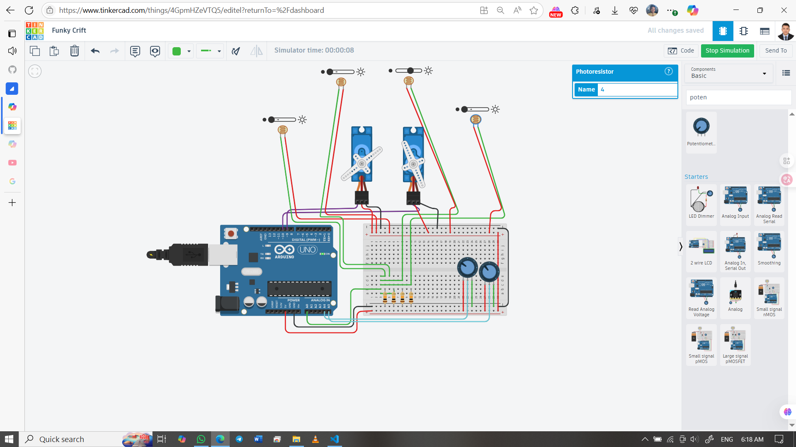

# ☀️ Solar Tracking System using Arduino UNO + Dual Servo + 4 LDRs

This project uses 4 LDRs and 2 servo motors to track the sun’s position and adjust a solar panel accordingly. The system moves horizontally (0–180°) and vertically (0–45°) to align with the brightest light source. Potentiometers allow dynamic control of servo movement limits.

## 👨‍🎓 Developed By  
Md Akhinoor Islam  
ESE (Energy Science and Engineering), KUET

---

## 🔧 Components Used

| Component                   | Quantity |
|------------------------------|----------|
| Arduino UNO                 | 1        |
| Servo Motor (SG90/MG995)    | 2        |
| LDR (Light Dependent Resistor) | 4      |
| 10kΩ Resistor               | 4        |
| Potentiometer (10kΩ)        | 2        |
| Breadboard + Jumper Wires   | as needed |
| Power Supply (5V)           | 1        |

---

## 🔌 Circuit Overview

| From (Arduino) | To (Component)     | Description                        |
|----------------|--------------------|------------------------------------|
| A0             | LDR Top Left       | Analog light input                 |
| A1             | LDR Top Right      | Analog light input                 |
| A2             | LDR Bottom Left    | Analog light input                 |
| A3             | LDR Bottom Right   | Analog light input                 |
| A4             | Potentiometer H    | Horizontal servo range control     |
| A5             | Potentiometer V    | Vertical servo range control       |
| D9             | Servo Motor H      | PWM control (horizontal movement)  |
| D10            | Servo Motor V      | PWM control (vertical movement)    |
| LDRs           | 10kΩ to GND        | Voltage divider configuration      |
| Servo VCC      | 5V                 | External power recommended         |
| Servo GND      | GND                | Common ground with Arduino         |

📌 Each LDR is paired with a 10kΩ resistor to form a voltage divider  
📌 Potentiometers are connected as voltage dividers: VCC → A4/A5 → GND  
📌 Servo motors may require external 5V supply for stable operation

---

## 💡 Learning Highlights

- ☀️ Light-based directional sensing using LDRs  
- 🔁 Dual-axis servo control with real-time feedback  
- 🎛️ Potentiometer-based dynamic range limiting  
- 🧠 Analog signal processing and averaging  
- 🧰 Practical embedded system for renewable energy

---

## 🖼️ Circuit Diagram  

---

## 🔗 Tinkercad Simulation  
[🔗 View Simulation on Tinkercad](https://www.tinkercad.com/things/4GpmHZeVTQ5-17-sun-trackhing-system)

---

## 📂 Folder Contents

- `README.md` → Project overview  
- `Code & Circuit Explanation (for beginner).md` → Circuit + code explanation  
- `code/solar-tracker-dual-servo.ino` → Arduino sketch  
- `circuit.png` → Tinkercad screenshot

---

## ✅ Project Status

✔️ Simulated successfully on Tinkercad  
☀️ Tracks sunlight in both horizontal and vertical axes  
📦 Part of Akhinoor’s 40 Arduino Project Series
