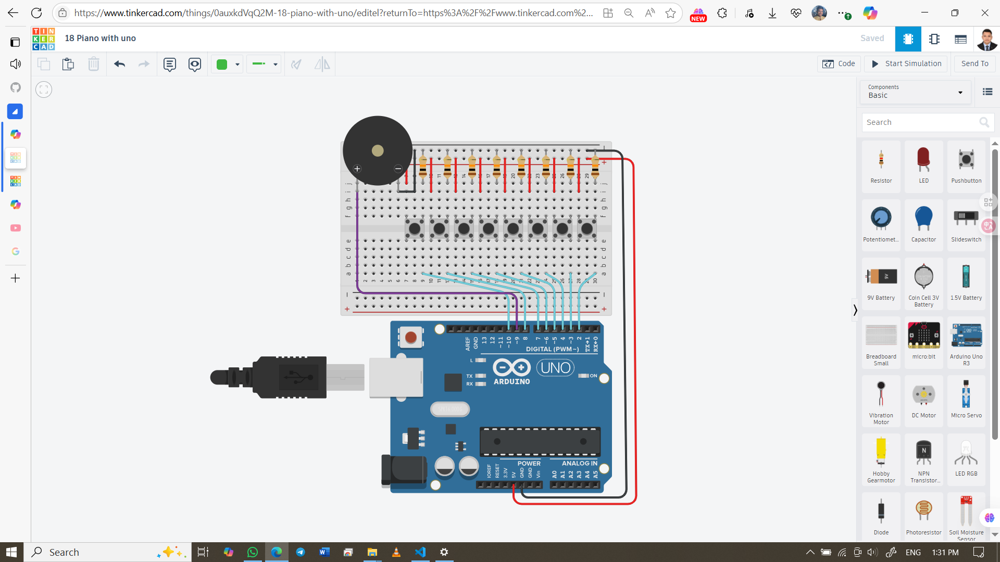

# 🎹 Piano with Arduino UNO using Push Buttons & Buzzer

This project simulates a simple piano using 8 push buttons and a piezo buzzer. Each button plays a different musical note (C4 to C5) when pressed. It’s a fun and beginner-friendly way to explore sound generation, digital input reading, and tone control with Arduino.

## 👨‍🎓 Developed By  
Md Akhinoor Islam  
ESE (Energy Science and Engineering), KUET

---

## 🔧 Components Used

| Component         | Quantity |
|--------------------|----------|
| Arduino UNO         | 1        |
| Push Button         | 8        |
| 10kΩ Resistor       | 8        |
| Piezo Buzzer        | 1        |
| Breadboard + Wires  | as needed |
| USB Cable / Power   | 1        |

---

## 🔌 Circuit Overview

| Arduino Pin | Connected To     | Description                        |
|--------------|------------------|------------------------------------|
| D2–D8, D10   | Push Buttons     | Digital input for each note        |
| Each Button  | 10kΩ to GND      | Pull-down resistor configuration   |
| D9           | Piezo Buzzer     | PWM output for tone generation     |
| Buzzer GND   | GND              | Common ground                      |
| 5V           | Button VCC side  | Powers button circuit              |

📌 Each button is connected between 5V and a digital pin  
📌 A 10kΩ resistor connects each digital pin to GND to ensure LOW when not pressed  
📌 Buzzer is driven using `tone()` function on pin D9

---

## 💡 Learning Highlights

- 🎵 Generate musical notes using `tone()` and `noTone()`  
- 🎛️ Use of pull-down resistors for clean digital input  
- 🎼 Map button presses to musical frequencies (C4 to C5)  
- 🧠 Understand how digitalRead() and arrays work together  
- 🧰 Build a monophonic piano with minimal components

---

## 🖼️ Circuit Diagram  


---

## 🔗 Tinkercad Simulation  
[🔗 View Simulation on Tinkercad](https://www.tinkercad.com/things/0auxkdVqQ2M-18-piano-with-uno)

---

## 📂 Folder Contents

- `README.md` → Project overview  
- `Code & Circuit Explanation (for beginner).md` → Circuit + code explanation  
- `code/piano-arduino.ino` → Arduino sketch  
- `circuit.png` → Tinkercad screenshot

---

## ✅ Project Status

✔️ Simulated successfully on Tinkercad  
🎶 All 8 notes play correctly via button press  
📦 Part of Akhinoor’s 40 Arduino Project Series
```
