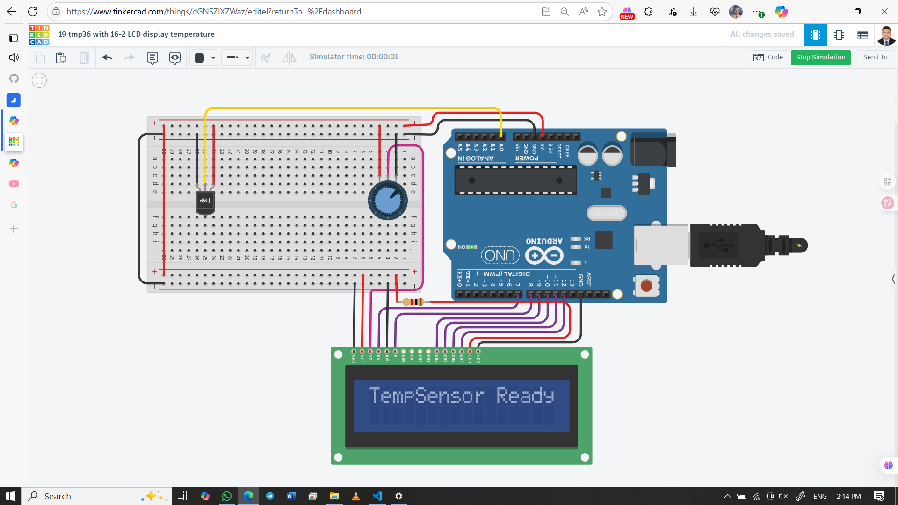

# 🌡️ Temperature Display with TMP36 Sensor & 16×2 LCD using Arduino UNO

This project reads ambient temperature using a TMP36 analog sensor and displays the result in °C on a 16×2 LCD. It’s a beginner-friendly embedded system that teaches analog signal processing, voltage-to-temperature conversion, and LCD interfacing.

## 👨‍🎓 Developed By  
Md Akhinoor Islam  
ESE (Energy Science and Engineering), KUET

---

## 🔧 Components Used

| Component             | Quantity |
|------------------------|----------|
| Arduino UNO           | 1        |
| TMP36 Temperature Sensor | 1     |
| 16×2 LCD (parallel)   | 1        |
| 10kΩ Potentiometer     | 1        |
| 220Ω Resistor (Optional) | 1     |
| Breadboard + Wires    | as needed |
| USB Cable / Power     | 1        |

---

## 🔌 Circuit Overview

### 🟢 TMP36 Sensor

| TMP36 Pin | Arduino Pin | Description               |
|-----------|-------------|---------------------------|
| Left (+V) | 5V          | Power supply              |
| Middle    | A0          | Analog output (Vout)      |
| Right (GND)| GND        | Ground                    |

### 📺 LCD 16×2 (4-bit mode)

| LCD Pin | Arduino Pin | Description               |
|---------|-------------|---------------------------|
| 1 (VSS) | GND         | Ground                    |
| 2 (VDD) | 5V          | Power supply              |
| 3 (VO)  | Pot middle  | Contrast control          |
| 4 (RS)  | D7          | Register Select           |
| 5 (RW)  | GND         | Write mode                |
| 6 (EN)  | D8          | Enable                    |
| 11–14   | D9–D12      | Data lines D4–D7          |
| 15 (LED+) | 5V via 220Ω | Backlight (optional)    |
| 16 (LED–)| GND        | Backlight ground          |

📌 Potentiometer: Left → GND, Middle → LCD VO, Right → 5V  
📌 TMP36 output voltage is linearly proportional to temperature

---

## 💡 Learning Highlights

- 🌡️ Analog temperature sensing with TMP36  
- 🔢 Voltage-to-temperature conversion using `(V – 0.5) × 100`  
- 📺 LCD interfacing in 4-bit mode  
- 🎛️ Contrast control using potentiometer  
- 🧠 Real-time sensor data display on embedded system

---

## 🖼️ Circuit Diagram  
### Circuit 1

### Circuit 2
.png)

---

## 🔗 Tinkercad Simulation  
[🔗 View Simulation on Tinkercad](https://www.tinkercad.com/things/dGNSZIXZWaz-19-tmp36-with-16-2-lcd-display-temperature)

---

## 📂 Folder Contents

- `README.md` → Project overview  
- `Code & Circuit Explanation (for beginner).md` → Circuit + code explanation  
- `code/temp-sensor-lcd.ino` → Arduino sketch  
- `circuit.png` → Tinkercad screenshot

---

## ✅ Project Status

✔️ Simulated successfully on Tinkercad  
🌡️ Displays accurate temperature in °C  
📦 Part of Akhinoor’s 40 Arduino Project Series
