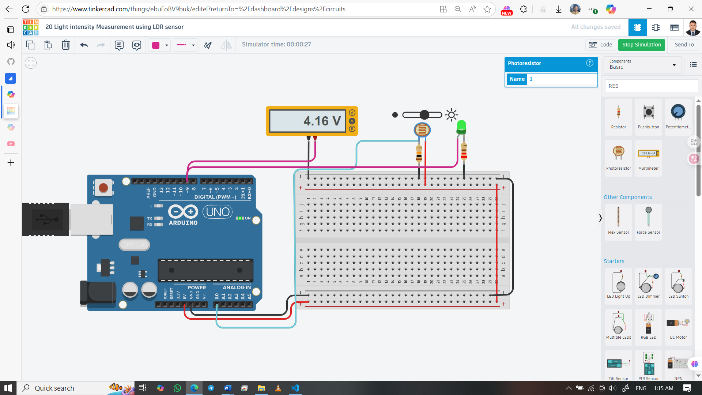

# 💡 Light Intensity Measurement with Arduino, LDR & LED

Measure ambient light intensity using an LDR and Arduino. The analog voltage from the LDR-resistor divider is read on A0, LED brightness is modulated via PWM on D9, and live voltage is printed to the Serial Monitor.

## 👨‍🎓 Developed By  
Md Akhinoor Islam  
ESE (Energy Science and Engineering), KUET

---

## 🔧 Components Used

| Component            | Quantity |
|-----------------------|----------|
| Arduino UNO           | 1        |
| LDR (Photoresistor)   | 1        |
| LED                   | 1        |
| 10 kΩ Resistor        | 1        |
| 220 Ω Resistor        | 1        |
| Multimeter            | 1        |
| Breadboard + Wires    | as needed |
| USB Cable / 5 V Supply| 1        |

---

## 🔌 Circuit Overview

| Arduino Pin | Connected To                | Description                         |
|-------------|-----------------------------|-------------------------------------|
| 5 V         | LDR leg                     | Power for voltage divider           |
| A0          | LDR-resistor junction (Node A) | Analog voltage input from divider |
| GND         | Fixed 10 kΩ resistor leg    | Completes voltage divider           |
| D9 (PWM)    | LED anode → 220 Ω → D9      | PWM output for LED brightness       |
| GND         | LED cathode → GND           | Common ground                       |

> **Node A** = junction of LDR and 10 kΩ resistor. Measure here with analogRead() or multimeter.

---

## 💡 Learning Highlights

- 🔢 Form a voltage divider with LDR + fixed resistor  
- 🌞 AnalogRead() to quantify light intensity (0–1023)  
- ⚡ Convert ADC reading → voltage (0–5 V)  
- 🌈 Map analog reading → 0–255 PWM for LED brightness  
- 📟 Real-time Serial Monitor output for voltage verification  
- 📏 Use a multimeter to cross-check readings

---

## 🖼️ Circuit Diagram  

---

## 🔗 Tinkercad Simulation  
[🔗 View on Tinkercad](https://www.tinkercad.com/things/ebuFoBV9buk-20-light-intensity-measurement-using-ldr-sensor)

---

## 📂 Folder Contents

- `README.md`  
- `Code & Circuit Explanation (for beginner).md`  
- `code/light-intensity-ldr.ino`  
- `circuit.png`  

---

## ✅ Project Status

✔️ Simulated successfully on Tinkercad  
💡 LED brightness follows ambient light intensity  
📟 Serial Monitor prints live voltage readings  
📦 Part of Akhinoor’s 40 Arduino Project Series
