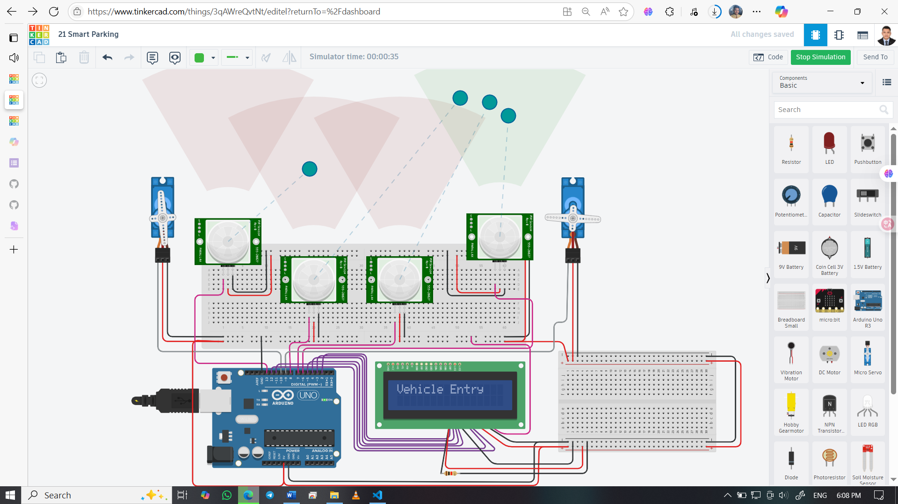

# 💡 Smart Parking System using Arduino, IR Sensors, LCD & Servo

A compact smart parking system that detects vehicle entry and exit using IR sensors, controls gate servos, and displays real-time slot availability on a 16x2 LCD. Ideal for learning automation, sensor integration, and display interfacing.

---

## 👨‍🎓 Developed By  
Md Akhinoor Islam  
ESE (Energy Science and Engineering), KUET

---

## 🔧 Components Used

| Component             | Quantity |
|------------------------|----------|
| Arduino UNO           | 1        |
| IR Sensor Module      | 4        |
| Servo Motor (SG90)    | 2        |
| 16x2 LCD (parallel)   | 1        |
| Potentiometer         | 1        |
| Breadboard + Wires    | as needed |
| USB Cable / 5V Supply | 1        |

---

## 🔌 Circuit Overview

| Arduino Pin | Connected To                  | Description                                |
|-------------|-------------------------------|--------------------------------------------|
| D6          | Entry IR sensor OUT           | Detects vehicle at entry                   |
| D13         | Exit IR sensor OUT            | Detects vehicle at exit                    |
| D7          | Slot 1 IR sensor OUT          | Detects car in parking slot 1              |
| D8          | Slot 2 IR sensor OUT          | Detects car in parking slot 2              |
| D9          | Entry Servo signal (S1)       | Controls entry gate                        |
| D10         | Exit Servo signal (S2)        | Controls exit gate                         |
| D12–D2      | LCD RS, E, D4–D7              | Parallel LCD control pins                  |
| A4          | Potentiometer (optional)      | Analog input for future use                |
| 5V / GND    | All sensors, LCD, servo power | Power supply and common ground             |

> **Note:** IR sensors output LOW when an object is detected. Servo angles: 0° = closed, 90° = open.

---

## 💡 Learning Highlights

- 🧠 Understand IR sensor logic and obstacle detection  
- ⚙️ Control servo motors for automated gate movement  
- 🖥️ Interface a 16x2 LCD in parallel mode  
- 📟 Display real-time slot status (Free/Occupied)  
- 🧪 Use Serial Monitor for debugging sensor states  
- 🔄 Combine multiple inputs and outputs in a single system  

---

## 🖼️ Circuit Diagram  

---

## 🔗 Tinkercad Simulation  
[🔗 View on Tinkercad](https://www.tinkercad.com/things/3qAWreQvtNt-21-smart-parking)

---

## 📂 Folder Contents

- `README.md`  
- `Code & Circuit Explanation (for beginner).md`  
- `code/smart-parking.ino`  
- `circuit.png`  

---

## ✅ Project Status

✔️ Simulated successfully on Tinkercad  
🚗 Entry/Exit gates respond to IR detection  
📟 LCD displays real-time slot status  
📦 Part of Akhinoor’s 40 Arduino Project Series  
🔧 Ready for expansion with IoT, RFID, or mobile app integration

---
