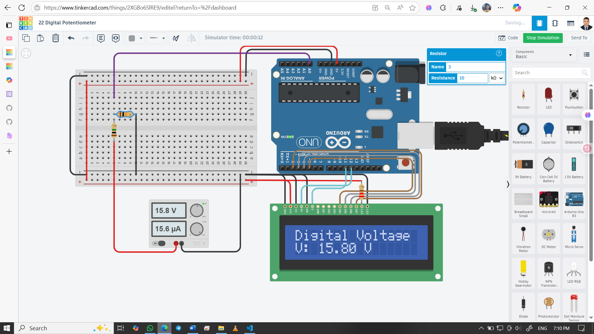

# 💡 Digital Potentiometer with Arduino & LCD

A simple yet powerful project to simulate a digital potentiometer using a voltage divider made of 1MΩ and 10kΩ resistors. Arduino reads the analog voltage, calculates the actual input voltage using the divider formula, and displays it on a 16x2 LCD in real-time.

---

## 👨‍🎓 Developed By  
Md Akhinoor Islam  
ESE (Energy Science and Engineering), KUET

---

## 🔧 Components Used

| Component             | Quantity |
|------------------------|----------|
| Arduino UNO           | 1        |
| 16x2 LCD (parallel)   | 1        |
| 1 MΩ Resistor         | 1        |
| 10 kΩ Resistor        | 1        |
| 220 Ω Resistor        | 1        |
| Breadboard + Wires    | as needed |
| USB Cable / 5V Supply | 1        |

---

## 🔌 Circuit Overview

| Arduino Pin | Connected To                  | Description                                |
|-------------|-------------------------------|--------------------------------------------|
| A0          | Node between 1MΩ & 10kΩ       | Analog voltage input from divider          |
| 5V          | Top of 1MΩ resistor           | Voltage source for divider                 |
| GND         | Bottom of 10kΩ resistor       | Ground reference                           |
| D12–D2      | LCD RS, E, D4–D7              | Parallel LCD control pins                  |
| 5V / GND    | LCD VCC, GND                  | Power supply for LCD                       |

> **Node A** = Junction between 1MΩ and 10kΩ resistors. This is where the analog voltage is read.

---

## 💡 Learning Highlights

- 🔢 Understand how voltage dividers work using resistors  
- 📏 Measure analog voltage using Arduino’s ADC  
- 🧮 Apply voltage divider formula to calculate actual input voltage  
- 📟 Display real-time voltage on a 16x2 LCD  
- 🧪 Use Serial Monitor for debugging and verification  
- 🔧 Explore how resistor ratios affect voltage scaling  

---

## 🖼️ Circuit Diagram  

---

## 🔗 Tinkercad Simulation  
[🔗 View on Tinkercad](https://www.tinkercad.com/things/2XGBo6SlRE9-22-digital-potentiometer)

---

## 📂 Folder Contents

- `README.md`  
- `Code & Circuit Explanation (for beginner).md`  
- `code/digital-potentiometer.ino`  
- `circuit.png`  

---

## ✅ Project Status

✔️ Simulated successfully on Tinkercad  
📟 LCD displays real-time calculated voltage  
🧮 Accurate voltage calculation using divider formula  
📦 Part of Akhinoor’s 40 Arduino Project Series  
🔧 Ready for expansion with variable resistors or analog sensors

---
